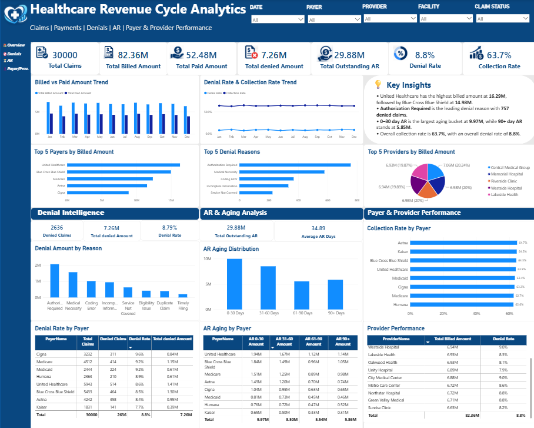

# Healthcare-RCM-Analytics

Healthcare Revenue Cycle Analytics using SQL Server and Power BI

## Project Overview

This project analyzes healthcare Revenue Cycle Management (RCM) data to evaluate claims, billing, payments, denials, accounts receivable, payer performance, and provider performance.

The solution uses SQL Server for data storage and analytical querying, and Microsoft Power BI for data modeling, DAX calculations, interactive analysis, and dashboard visualization.

## Business Objectives

- Monitor claim volume and financial performance
- Analyze billed, paid, and outstanding AR amounts
- Measure denial rate and denial amounts
- Identify major denial reasons
- Evaluate payer performance
- Compare provider performance
- Analyze AR aging across different aging buckets
- Track collection performance over time

## Tools & Technologies

- **SQL Server** — Data storage, joins, aggregations, CTEs, subqueries, CASE expressions, and window functions
- **Power BI** — Data modeling, interactive dashboarding, and visualization
- **Power Query** — Data preparation and data type validation
- **DAX** — Business measures, KPIs, time intelligence, and analytical calculations
- **Excel** — Initial source dataset
- **GitHub** — Project documentation and version control

## Data Model

The project follows a **Star Schema** design.

### Fact Table

- `FactClaims`

### Dimension Tables

- `DimDate`
- `DimPayer`
- `DimProvider`
- `DimFacility`
- `DimDenialReason`

The fact table stores claim-level financial and operational data, while the dimension tables provide descriptive attributes for analysis.

Key relationships connect the dimension tables to `FactClaims` through their respective IDs, with `DimDate` related to the claim `ServiceDate`.

## SQL Analysis

SQL Server was used to perform analytical queries across the healthcare RCM dataset.

Key analyses included:

- Claim status distribution
- Billed amount by claim status
- Billed amount by payer
- Billed amount by provider
- Claim value classification using `CASE WHEN`
- Denial reason analysis
- Denial rate by payer
- Collection rate by payer
- AR aging analysis
- Monthly billed vs paid analysis
- Provider denial rate
- Payer ranking using `RANK()` and `DENSE_RANK()`
- Previous-month analysis using `LAG()`
- CTE and subquery-based benchmarking
- Top providers within each specialty using `ROW_NUMBER()`
- Provider performance benchmarking using multiple CTEs

## Power BI Dashboard

The Power BI dashboard provides an executive view of healthcare Revenue Cycle performance.

### Key KPIs

- Total Claims
- Total Billed Amount
- Total Paid Amount
- Total Outstanding AR
- Total Denied Amount
- Denial Rate
- Collection Rate

### Dashboard Analysis

- Billed vs Paid Amount Trend
- Denial Rate & Collection Rate Trend
- Top 5 Payers by Billed Amount
- Top 5 Denial Reasons
- Top 5 Providers by Billed Amount
- Denial Intelligence
- AR & Aging Analysis
- Payer & Provider Performance
- Interactive filtering by Date, Payer, Provider, Facility, and Claim Status

## DAX Measures

DAX was used to create reusable business measures and analytical calculations, including:

- Total Claims
- Total Billed Amount
- Total Paid Amount
- Total Outstanding AR
- Denied Claims
- Denial Rate
- Collection Rate
- Average AR Days
- Total Denied Amount
- Denied Amount Rate
- AR aging measures
- YTD Billed Amount
- YTD Paid Amount
- Previous Month Paid Amount
- Month-over-Month Paid Growth
- YTD Denied Claims
- YTD Denied Amount

Time-intelligence calculations were implemented using functions such as `TOTALYTD()` and `DATEADD()`.

## Key Business Insights

- United Healthcare had the highest billed amount at approximately **16.29M**, followed by Blue Cross Blue Shield at approximately **14.98M**.
- **Authorization Required** was the leading denial reason with **757 denied claims**.
- The **0–30 day AR bucket** represented the largest outstanding AR amount at approximately **9.97M**.
- The **90+ day AR bucket** contained approximately **5.85M**, highlighting older outstanding receivables.
- Overall collection rate was approximately **63.7%**.
- Overall denial rate was approximately **8.8%**.

## Project Workflow

```text
Excel Dataset
     ↓
SQL Server
     ↓
SQL Analysis
     ↓
Power BI Connection
     ↓
Power Query
     ↓
Star Schema
     ↓
DAX Measures
     ↓
Interactive Power BI Dashboard
     ↓
SQL ↔ Power BI Validation
```

## Data Disclaimer

This project uses a **synthetic healthcare RCM dataset** created for learning, portfolio development, and demonstration purposes.

The dataset does not contain real patient information or Protected Health Information (PHI).

## Validation

The Power BI dashboard was validated against SQL Server analysis to confirm consistency across key business metrics.

Validation included:

- Claim counts
- Billed amounts
- Paid amounts
- Outstanding AR
- Denied amounts
- Denial rates
- Collection rates
- AR aging
- Payer performance
- Provider performance
- Monthly billed vs paid trends

## Limitations

- The dataset is synthetic and intended for portfolio demonstration.
- The analysis focuses on core healthcare RCM metrics and does not represent a production healthcare environment.
- Advanced production topics such as database performance tuning, stored procedures, security implementation, and automated data pipelines are outside the scope of the project.

## Dashboard Preview

The final Power BI dashboard provides an executive view of healthcare Revenue Cycle Management performance, covering claims, billing, payments, denials, AR aging, payer performance, and provider performance.



## Project Structure

```text
Healthcare-RCM-Analytics/
│
├── Dataset/
│   └── Healthcare_RCM_Analytics_Dataset_v2.xlsx
│
├── SQL/
│   └── Healthcare_RCM_SQL_Analysis.sql
│
├── Healthcare_RCM_Analytics_Project.pbix
├── healthcare-revenue-dashboard.png
└── README.md
```

## Project Outcome

This project demonstrates an end-to-end healthcare analytics workflow using **SQL Server and Power BI**.

It showcases practical skills in:

- Healthcare RCM analytics
- SQL data analysis
- Relational data modeling
- Star schema design
- Power Query
- DAX
- Power BI dashboard development
- KPI development
- Denial and AR analysis
- Payer and provider performance analysis
- Business insight generation

## Author

**Mohammad Danish Muttain Khan**

Aspiring Data Analyst specializing in **SQL, Power BI, Excel, and healthcare RCM analytics**.
